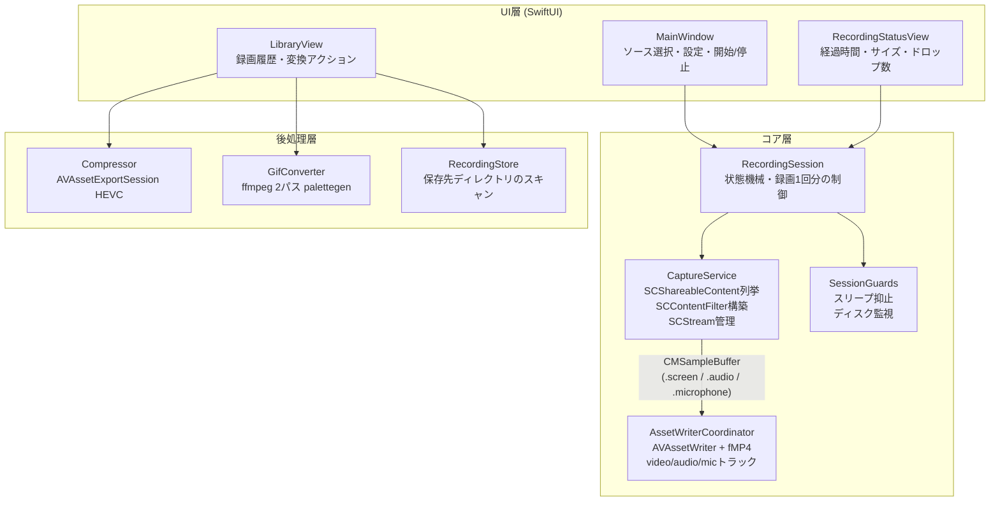
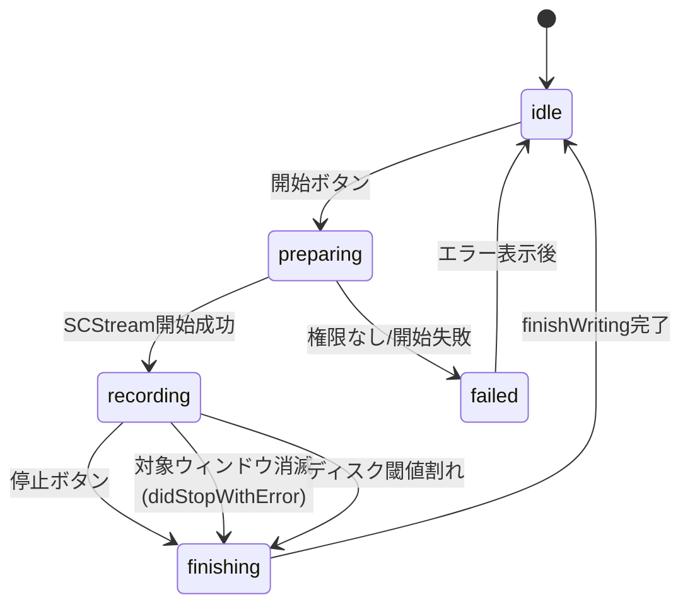

# CasRec — 個人用スクリーンレコーダー設計書

仮称: **CasRec**(名称は自由に変更可)。作成日: 2026-08-02。ステータス: 設計完了・実装未着手。

## 1. 目的と背景

ツイキャスなどの**期間限定ライブ配信を、視聴しながら個人保存用に録画する**ためのmacOSアプリ。日常的に使うため、「撮り直しがきかない長時間録画を、他の作業をしながら、確実に残せる」ことを最優先の設計目標とする。

- 利用は私的使用のための複製の範囲に限る(録画物の再配布・再アップロードはスコープ外の行為であり、本ツールは共有機能を持たない)。
- 画面キャプチャ方式(OBSやQuickTimeと同じ方式)であり、ストリームの直接ダウンロードやDRM回避は行わない。

### スコープ外

- Webカメラ合成(要件ヒアリングで不要と確認)
- クラウドアップロード・共有機能
- 配布(App Store / 公証)。自分のMacでビルドして使う前提
- Windows / Linux 対応

## 2. 要件

ヒアリング結果から導出。**太字**はユースケース(配信保存)から導かれる暗黙要件。

| # | 要件 | 出所 |
|---|------|------|
| R1 | ウィンドウを持つGUIアプリ。録画スコープをUIで指定できる | ヒアリング |
| R2 | 録画範囲の選択: 全画面 / 特定ウィンドウ / 矩形領域 | ヒアリング |
| R3 | 音声録音(配信音声=対象アプリの音声が主。マイクはオプション) | ヒアリング |
| R4 | GIF / 圧縮出力への変換 | ヒアリング |
| R5 | **長時間録画(1〜3時間)で安定動作。低CPU/メモリ負荷** | 配信保存 |
| R6 | **録画中にクラッシュ・強制終了しても、それまでの録画が再生可能で残る** | 撮り直し不可 |
| R7 | **録画対象ウィンドウを背面に置いたまま、他の作業ができる** | 日常利用 |
| R8 | **対象アプリの音声だけを録る(通知音や他アプリの音を混ぜない)** | 配信保存 |
| R9 | **録画中のスリープ抑止、ディスク空き容量の監視** | 長時間録画 |
| R10 | 配信終了(ウィンドウが閉じた)時も録画ファイルを正常に閉じる | 配信保存 |

## 3. 技術選定

**結論: Swift + SwiftUI + ScreenCaptureKit + AVFoundation(AVAssetWriter)。外部依存はGIF変換のffmpegのみ(任意)。**

| 選定 | 理由 |
|------|------|
| ScreenCaptureKit (SCK) | macOS純正のキャプチャAPI。①ウィンドウ単位キャプチャは背面でも録画継続(R7)、②フィルタ対象アプリの音声だけをキャプチャ可能(R8)、③GPU支援で長時間でも低負荷(R5) |
| AVAssetWriter 直書き | `movieFragmentInterval` によるフラグメント化QuickTimeファイルでクラッシュ耐性を実現(R6)。macOS 15+の簡易API `SCRecordingOutput` はフラグメント化を制御できないため不採用 |
| SwiftUI | シングルウィンドウの設定+コントロールUI程度なら最短。macOS 15+ターゲットなら制約も少ない |
| ffmpeg(任意依存) | GIF変換のみに使用。Homebrewの `ffmpeg` を検出、無ければGIF機能をグレーアウトして案内。**圧縮出力はAVAssetExportSessionで実装し、ffmpeg無しでも動く** |

不採用案:

- **Tauri / Electron**: システム音声・アプリ単位音声のキャプチャに結局ネイティブ(SCK)コードが必要になり、二重実装になる。クロスプラットフォーム化の予定もない。
- **SCRecordingOutput(macOS 15+の録画API)**: 実装は最も簡単だが、書き込み中ファイルのフラグメント化が制御できず、クラッシュ時にファイル全損のリスク。R6と衝突するため、サンプルバッファを自前でAVAssetWriterに書く。

最低ターゲット: **macOS 15**(開発機はmacOS 26)。マイク統合(`captureMicrophone`)等のAPIが揃う。

## 4. アーキテクチャ



### コンポーネント責務

| コンポーネント | 責務 |
|----------------|------|
| `CaptureService` | SCShareableContentの列挙(ディスプレイ/ウィンドウ、サムネイル付き)、SCContentFilter構築、SCStreamの開始/停止/エラー中継。UIとは`AsyncStream`で疎結合 |
| `RecordingSession` | 録画1回分のライフサイクル制御と状態機械(下図)。Guards の起動/解除もここ |
| `AssetWriterCoordinator` | CMSampleBufferの受領とAVAssetWriterへの書き込み。セッション開始時刻の管理、`finishWriting`の確実な実行 |
| `SessionGuards` | `ProcessInfo.beginActivity`(idle/system sleep抑止)、ディスク空き容量ポーリング(閾値割れで警告→自動停止) |
| `RecordingStore` | 保存先(`~/Movies/CasRec/`)のスキャンで履歴を構成。DBは持たない(ファイルシステムが真実) |
| `Compressor` / `GifConverter` | 録画後の変換ジョブ(非同期、進捗表示)。原本は変換後も残す |

### 録画状態機械



**重要**: `recording → finishing` はどの経路(手動停止・対象消滅・エラー・ディスク逼迫)でも必ず `finishWriting` を通す。配信終了でブラウザタブが閉じられたケース(R10)は「異常」ではなく正常終了経路として扱う。

## 5. 録画パイプライン詳細

### 5.1 キャプチャ設定(SCStreamConfiguration)

| 項目 | 既定値 | 備考 |
|------|--------|------|
| 解像度 | 対象のネイティブピクセルサイズ(Retina 2x) | 設定で50%に落とせる(配信元が720p程度なら十分) |
| フレームレート | 30fps (`minimumFrameInterval = 1/30`) | 配信保存には十分。設定で60fps |
| `capturesAudio` | true | フィルタ対象の音声のみ(R8) |
| `excludesCurrentProcessAudio` | true | 自アプリの操作音を除外 |
| `captureMicrophone` | false(トグルで有効化) | 有効時は別トラックに記録 |
| `showsCursor` | false | 配信録画にカーソルは不要。設定で変更可 |
| `queueDepth` | 5 | バッファ詰まり対策の既定値 |

### 5.2 フィルタ構築(R2: 録画範囲)

| モード | SCContentFilter | 備考 |
|--------|-----------------|------|
| ウィンドウ | `init(desktopIndependentWindow:)` | **主用途**。背面でも録画継続。音声はそのアプリのもの |
| 全画面 | `init(display:excludingWindows: [自アプリ])` | 音声はシステム全体(自アプリ除く) |
| 矩形領域 | 全画面フィルタ + `sourceRect` 指定 | Phase 3。透明オーバーレイウィンドウでドラッグ選択 |

### 5.3 書き込み(R6: クラッシュ耐性)

```
SCStream
  ├─ .screen  ─▶ SCStreamOutput ─▶ AVAssetWriterInput(video)
  ├─ .audio   ─▶ SCStreamOutput ─▶ AVAssetWriterInput(audio)
  └─ .microphone ─▶ SCStreamOutput ─▶ AVAssetWriterInput(audio2) ※有効時のみ
```

- コンテナ: **QuickTime (.mov)**、`movieFragmentInterval = 10秒`。プロセスが `kill -9` で死んでも最後のフラグメント境界までは再生可能なファイルが残る。
- ビデオコーデック: **HEVC(ハードウェアエンコード)** 既定。1080p30で約4Mbps → 2時間 ≈ 3.6GB。互換性重視の H.264(8Mbps)も選択可。
- オーディオ: AAC 48kHz ステレオ 160kbps。
- ドロップフレーム: `SCStreamFrameInfo` の status が complete 以外のフレームをカウントし、録画中UIに表示(R5の健全性監視)。
- 最初のvideoサンプル到着時刻を `startSession(atSourceTime:)` に使い、A/V同期の基準とする。

### 5.4 長時間録画対策(R5, R9)

- `ProcessInfo.beginActivity([.idleDisplaySleepDisabled, .idleSystemSleepDisabled, .userInitiated])` を録画中のみ保持。App Napも同時に無効化される。
- ディスク監視: 30秒ごとに保存先ボリュームの空きを確認。**5GB未満で警告表示、2GB未満で自動停止**(finishing経由なのでファイルは無事)。
- 録画中はウィンドウを閉じてもアプリを終了しない(closeはhide扱い)。アプリ終了(⌘Q)は録画中なら確認ダイアログ→finishing完了を待ってから終了。

## 6. 主要設計判断(ADR要約)

| # | 判断 | 理由 | 却下した代替案 |
|---|------|------|----------------|
| D1 | AVAssetWriter直書き+fMP4 | R6(全損回避)が配信保存の核心価値 | SCRecordingOutput(簡単だが全損リスク) |
| D2 | ウィンドウ単位キャプチャを主モードに | 背面録画(R7)+アプリ音声分離(R8)が同時に手に入る | 全画面録画主体(通知音混入・ながら作業不可) |
| D3 | 履歴はファイルシステムをスキャン、DB無し | Simplicity First。メタデータはファイル名で足りる | SQLite/SwiftData(過剰) |
| D4 | 圧縮はAVFoundation、GIFのみffmpeg任意依存 | 依存ゼロで核心機能が完結。GIFは品質面でffmpeg優位 | 全部ffmpeg(必須依存化)/全部AVFoundation(GIF品質難) |
| D5 | ソース選択は自前リストUI(サムネイル付き) | 矩形領域(Phase 3)まで一貫したUXにできる | SCContentSharingPicker(楽だが領域選択が無く拡張性に欠ける) |

## 7. UI設計

シングルウィンドウ+タブ(またはサイドバー)2画面構成。

### 録画画面

```
┌─────────────────────────────────────────┐
│ [ウィンドウ] [画面全体] [領域(P3)]     ← モード切替
│ ┌─────┐ ┌─────┐ ┌─────┐            │
│ │thumb│ │thumb│ │thumb│  …          ← 対象一覧(2秒毎更新)
│ └─────┘ └─────┘ └─────┘            │
│ 音声: [✓]対象アプリ  [ ]マイク         │
│ 画質: [HEVC ▾] [ネイティブ ▾] [30fps ▾]│
│ 保存先: ~/Movies/CasRec  [変更]        │
│                                         │
│           [ ● 録画開始 ]               │
│  録画中: 00:42:13 / 1.2GB / drop 0     ← recording時のみ
│           [ ■ 停止 ]                   │
└─────────────────────────────────────────┘
```

### ライブラリ画面

- `~/Movies/CasRec/` の一覧(新しい順)。行: サムネイル、ファイル名、日時、時間、サイズ。
- 行アクション: QuickLookプレビュー / Finderで表示 / **圧縮(HEVC)** / **GIF変換**(ffmpeg検出時のみ活性) / 削除(ゴミ箱へ)。
- 変換はジョブキューで直列実行、行内に進捗表示。

### ファイル命名

`<対象名>-yyyyMMdd-HHmmss.mov`(例: `Safari-20260802-213005.mov`)。変換物は `-compressed.mp4` / `.gif` サフィックス。

## 8. 権限とプロジェクト設定

| 項目 | 内容 |
|------|------|
| 画面収録(TCC) | 初回の `SCShareableContent` 取得時にOSが要求。未許可時は設定誘導UIを表示 |
| マイク | `NSMicrophoneUsageDescription`。マイクトグル有効化時のみ要求 |
| App Sandbox | **無効**(個人ビルド・非配布のため。ffmpeg起動やMovies配下書き込みが単純になる) |
| 署名 | ローカルの開発証明書で固定。**署名が変わるとTCC許可がリセットされるため、ad-hoc署名でのビルドは避ける**(開発時の落とし穴) |
| プロジェクト | Xcodeプロジェクト、単一Appターゲット。ディレクトリは§10 |

## 9. 既知の制約(仕様として明記)

- 対象ウィンドウの**最小化(⌘M)やタブ切り替えは映像が止まる**。背面に置くのはOK。運用: 録画対象は最小化せず背面へ。
- 録画中の対象ウィンドウのリサイズは、開始時解像度へのスケーリング(レターボックス)になる。録画前にサイズを決める。
- DRM保護コンテンツ(Netflix等のFairPlay)は黒画面になる。ツイキャス等の通常HLS配信は対象外の制約。
- GIF変換はffmpeg(Homebrew)が無いと使えない(UIで `brew install ffmpeg` を案内)。

## 10. ディレクトリ構成

```
casrec/
├── DESIGN.md
├── tasks/                  # todo.md / lessons.md(実装開始時に作成)
└── CasRec/                 # Xcodeプロジェクト
    ├── App/                # エントリポイント、AppDelegate(終了ガード)
    ├── Capture/            # CaptureService, ShareableContentProvider
    ├── Recording/          # RecordingSession, AssetWriterCoordinator, SessionGuards
    ├── PostProcess/        # Compressor, GifConverter, FfmpegLocator
    ├── Library/            # RecordingStore, RecordingItem
    └── UI/                 # MainWindow, RecordView, LibraryView, StatusView
```

## 11. Assumption Ledger(実装時に検証)

| 仮定 | 状態 | 検証方法 |
|------|------|----------|
| ウィンドウフィルタ時、音声はそのアプリのみになる | UNVERIFIED | Phase 1で通知音を鳴らして録画→混入しないこと |
| `movieFragmentInterval` 設定で `kill -9` 後もファイル再生可 | UNVERIFIED | Phase 2の完了条件(下記) |
| 背面ウィンドウ・別Spaceのウィンドウでもフレーム更新される | UNVERIFIED | Phase 1で実測(別Spaceは要注意) |
| HEVCハードウェアエンコードで2時間録画してもメモリが安定 | UNVERIFIED | Phase 2で2時間実録、Activity Monitorで確認 |
| macOS 26でのSCK API挙動が15と同等 | UNVERIFIED | 実装しながら確認(差異はここに追記) |

## 12. 実装フェーズ

各フェーズは完了条件(検証コマンド/手順)を満たしてから次へ。

### Phase 1 — 録れる(コア価値の成立)
- プロジェクト作成、画面収録権限フロー
- ソース一覧(ウィンドウ/ディスプレイ、サムネイル)
- ウィンドウ録画+アプリ音声 → fMP4書き出し、開始/停止
- スリープ抑止
- **完了条件**: ブラウザの配信ウィンドウを背面に置いたまま30分録画し、映像・音声が同期した .mov が再生できる。通知音が混入していない。

### Phase 2 — 安心して録れる(信頼性)
- 録画中の `kill -9` 試験 → 直前フラグメントまで再生可能なこと
- ディスク監視(警告/自動停止)、ドロップフレーム表示
- 対象ウィンドウ消滅時の正常finalize(R10)
- マイクトラック(オプション)
- **完了条件**: 2時間連続録画でメモリ横ばい・drop僅少。録画中プロセスkillでファイル再生可。タブを閉じても .mov が正常に閉じる。

### Phase 3 — 便利に使える
- ライブラリ画面(履歴・QuickLook・削除)
- HEVC圧縮(AVAssetExportSession)、GIF変換(ffmpeg検出)
- 矩形領域選択(オーバーレイUI + sourceRect)
- 全画面モード
- **完了条件**: 録画→圧縮→GIFの一連がUIから完結。ffmpeg無し環境でGIFのみ非活性。

### Phase 4 — 磨き(任意)
- 録画予約タイマー(配信開始時刻に自動開始)
- メニューバーからのクイック開始(常駐化)
- ホットキー
