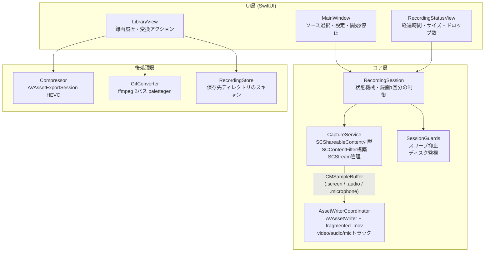
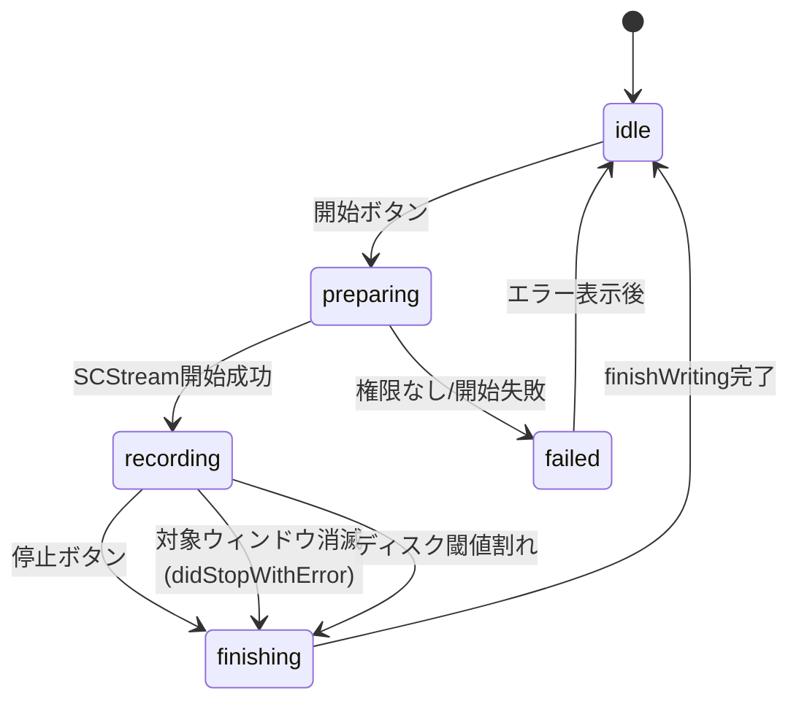

# CasRec — 個人用スクリーンレコーダー設計書

仮称: **CasRec**(名称は自由に変更可)。作成日: 2026-08-02。ステータス: 設計完了・実装未着手。

## 1. 目的と背景

ツイキャスなどの**期間限定ライブ配信を、視聴しながら個人保存用に録画する**ためのmacOSアプリ。日常的に使うため、「撮り直しがきかない長時間録画を、他の作業をしながら、確実に残せる」ことを最優先の設計目標とする。

- 利用は私的使用のための複製の範囲に限る(録画物の再配布・再アップロードはスコープ外の行為であり、本ツールは共有機能を持たない)。
- 画面キャプチャ方式(OBSやQuickTimeと同じ方式)であり、ストリームの直接ダウンロードやDRM回避は行わない。

### スコープ外

- Webカメラ合成(要件ヒアリングで不要と確認)
- クラウドアップロード・共有機能
- 配布(App Store / 公証)。自分のMacでビルドして使う前提
- Windows / Linux 対応

## 2. 要件

ヒアリング結果から導出。**太字**はユースケース(配信保存)から導かれる暗黙要件。

| # | 要件 | 出所 |
|---|------|------|
| R1 | ウィンドウを持つGUIアプリ。録画スコープをUIで指定できる | ヒアリング |
| R2 | 録画範囲の選択: 全画面 / 特定ウィンドウ / 矩形領域 | ヒアリング |
| R3 | 音声録音(配信音声=対象アプリの音声が主。マイクはオプション) | ヒアリング |
| R4 | GIF / 圧縮出力への変換 | ヒアリング |
| R5 | **長時間録画(1〜3時間)で安定動作。低CPU/メモリ負荷** | 配信保存 |
| R6 | **録画中にクラッシュ・強制終了しても、可能な限り録画済み部分を復旧・再生できる** | 撮り直し不可 |
| R7 | **録画対象ウィンドウを背面に置いたまま、他の作業ができる** | 日常利用 |
| R8 | **対象アプリ由来の音声を優先して録り、通知音や他アプリ音の混入を避ける**(分離の単位はアプリ/プロセス。§9の制約参照) | 配信保存 |
| R9 | **録画中のスリープ抑止、ディスク空き容量の監視** | 長時間録画 |
| R10 | 録画対象ウィンドウが閉じられた場合も録画ファイルを正常に閉じる | 配信保存 |

## 3. 技術選定

**結論: Swift + SwiftUI + ScreenCaptureKit + AVFoundation(AVAssetWriter)。外部依存はGIF変換のffmpegのみ(任意)。**

| 選定 | 理由 |
|------|------|
| ScreenCaptureKit (SCK) | macOS純正のキャプチャAPI。①ウィンドウ単位キャプチャは背面でも録画継続(R7)、②音声をアプリ(プロセス)単位で選択キャプチャ可能(R8)、③GPU支援で長時間でも低負荷(R5) |
| AVAssetWriter 直書き | `movieFragmentInterval` による fragmented .mov でクラッシュ耐性を高める(R6)。macOS 15+の簡易API `SCRecordingOutput` はフラグメント化を制御できないため不採用 |
| SwiftUI | シングルウィンドウの設定+コントロールUI程度なら最短。macOS 15+ターゲットなら制約も少ない |
| ffmpeg(任意依存) | GIF変換と破損ファイルのremux救済(§5.5)に使用。`/opt/homebrew/bin` → `/usr/local/bin` → `PATH` → ユーザー指定パスの順に検出し、無ければ該当機能をグレーアウトして案内。**圧縮出力はAVAssetExportSessionで実装し、ffmpeg無しでも動く** |

不採用案:

- **Tauri / Electron**: システム音声・アプリ単位音声のキャプチャに結局ネイティブ(SCK)コードが必要になり、二重実装になる。クロスプラットフォーム化の予定もない。
- **SCRecordingOutput(macOS 15+の録画API)**: 実装は最も簡単だが、書き込み中ファイルのフラグメント化が制御できず、クラッシュ時にファイル全損のリスク。R6と衝突するため、サンプルバッファを自前でAVAssetWriterに書く。

最低ターゲット: **macOS 15**(開発機はmacOS 26)。マイク統合(`captureMicrophone`)等のAPIが揃う。

## 4. アーキテクチャ



### コンポーネント責務

| コンポーネント | 責務 |
|----------------|------|
| `CaptureService` | SCShareableContentの列挙(ディスプレイ/ウィンドウ、サムネイル付き)、SCContentFilter構築、SCStreamの開始/停止/エラー中継。UIとは`AsyncStream`で疎結合 |
| `RecordingSession` | 録画1回分のライフサイクル制御と状態機械(下図)。Guards の起動/解除もここ |
| `AssetWriterCoordinator` | CMSampleBufferの受領とAVAssetWriterへの書き込み。セッション開始時刻の管理、`finishWriting`の確実な実行 |
| `SessionGuards` | `ProcessInfo.beginActivity`(idle/system sleep抑止)、ディスク空き容量ポーリング(閾値割れで警告→自動停止) |
| `RecordingStore` | 保存先(`~/Movies/CasRec/`)のスキャンで履歴を構成。DBは持たない(ファイルシステムが真実) |
| `Compressor` / `GifConverter` | 録画後の変換ジョブ(非同期、進捗表示)。原本は変換後も残す |

### 録画状態機械



**重要**: `recording → finishing` はどの経路(手動停止・対象消滅・エラー・ディスク逼迫)でも必ず `finishWriting` を通す。録画対象ウィンドウ自体が閉じられたケース(R10)は「異常」ではなく正常終了経路として扱う。なおブラウザの**タブ**を閉じてもウィンドウは消滅せず別タブの内容が録画され続けるため、配信終了時の停止は基本的に手動操作(§9)。

## 5. 録画パイプライン詳細

### 5.1 キャプチャ設定(SCStreamConfiguration)

| 項目 | 既定値 | 備考 |
|------|--------|------|
| 解像度 | 対象のネイティブピクセルサイズ(Retina 2x) | 設定で50%に落とせる(配信元が720p程度なら十分) |
| フレームレート | 30fps (`minimumFrameInterval = 1/30`) | 配信保存には十分。設定で60fps |
| `capturesAudio` | true | フィルタ対象アプリ/プロセス由来の音声(R8、制約は§9) |
| `excludesCurrentProcessAudio` | true | 自アプリの操作音を除外 |
| `captureMicrophone` | false(トグルで有効化) | 有効時は別トラックに記録 |
| `showsCursor` | false | 配信録画にカーソルは不要。設定で変更可 |
| `queueDepth` | 5 | バッファ詰まり対策の既定値 |

### 5.2 フィルタ構築(R2: 録画範囲)

| モード | SCContentFilter | 備考 |
|--------|-----------------|------|
| ウィンドウ | `init(desktopIndependentWindow:)` | **主用途**。背面でも録画継続。音声はそのウィンドウを持つアプリ(プロセス)単位 |
| 全画面 | `init(display:excludingWindows: [自アプリ])` | 音声はシステム全体(自アプリ除く) |
| 矩形領域 | **ウィンドウフィルタ** + `sourceRect` 指定 | 実装済み。対象ウィンドウの最新スクリーンショット上でドラッグ選択し、ウィンドウ content 座標(ポイント)の `sourceRect` として渡す。ウィンドウ方式のアプリ音声分離・背面録画特性を維持する |

### 5.3 書き込み(R6: クラッシュ耐性)

```
SCStream
  ├─ .screen  ─▶ SCStreamOutput ─▶ AVAssetWriterInput(video)
  ├─ .audio   ─▶ SCStreamOutput ─▶ AVAssetWriterInput(audio)
  └─ .microphone ─▶ SCStreamOutput ─▶ AVAssetWriterInput(audio2) ※有効時のみ
```

- コンテナ: **QuickTime (.mov)**、`movieFragmentInterval = 10秒` の fragmented .mov。クラッシュ・強制終了時にも直前のフラグメント境界まで復旧・再生できる可能性を高める。実際の再生可否は書き込み中断タイミングや再生側(QuickTime Player / AVFoundation / ffmpeg)の許容度に依存するため断定せず、Phase 2 の `kill -9` 試験で実挙動を検証し、§5.5 の救済導線で補完する。
- **クラッシュ耐性は現時点で条件付き(既知の制約)**: 有効化した音声入力にサンプルが1件も届かない場合(音声入力ON+完全無音のアプリ等。既定は App Audio ON なので無音アプリで発生しうる)、fragmented .mov の復旧可能なプレフィックスが生成されないことが実測で判明している。音声サンプルが流れている通常の配信録画、または音声入力OFFの録画では有効。飢餓入力の扱い(タイムアウトでの `markAsFinished` 等)は R3/R8 と R6 のトレードオフを含むため Phase 2 で対処し、`kill -9` × 無音アプリを試験マトリクスに含める(§12)。
- ビデオコーデック: **HEVC(ハードウェアエンコード)** 既定。1080p30で約4Mbps → 2時間 ≈ 3.6GB。互換性重視の H.264(8Mbps)も選択可。
- オーディオ: AAC 48kHz ステレオ 160kbps。マイクは別トラック(audio2)を仮置きとするが、第2オーディオトラックを再生しないプレイヤーもあるため、**別トラック維持か1トラックへのミックスかはPhase 2(マイク実装時)に決める**。
- フレーム健全性(R5)— `SCStreamFrameInfo` の status を次の方針で扱う:
  - `complete` → 書き込み対象。
  - `idle`(画面変化なし)→ 正常。dropに数えない(静止した画面での誤警告を防ぐ)。
  - 上記以外(`blank` / `suspended` / `stopped` 等)→ 異常フレームとしてカウントし、録画中UIに `drops` として表示。
  - 加えて**stall検知**: 最終videoサンプル受信からの経過時間を監視し、10秒以上フレームが来なければUIに警告する。最小化など「§9の仕様どおり映像が止まっている」状態を「録画失敗」と誤解させないため、警告文には推定原因(対象が最小化されていないか等)を含める。しきい値はPhase 2で調整。
- 最初のvideoサンプル到着時刻を `startSession(atSourceTime:)` に使い、A/V同期の基準とする。

### 5.4 長時間録画対策(R5, R9)

- `ProcessInfo.beginActivity([.idleDisplaySleepDisabled, .idleSystemSleepDisabled, .userInitiated])` を録画中のみ保持。App Napも同時に無効化される。
- ディスク監視: 30秒ごとに保存先ボリュームの空きを確認。**5GB未満で警告表示、2GB未満で自動停止**(finishing経由なのでファイルは無事)。Phase 2 で平均書き込みレートから残り録画可能時間を推定し、「残り30分で警告」等の時間ベース閾値を固定値と併用するか検討する。
- 録画中はウィンドウを閉じてもアプリを終了しない(closeはhide扱い)。アプリ終了(⌘Q)は録画中なら確認ダイアログ→finishing完了を待ってから終了。

### 5.5 エラー分類と救済

| 種別 | 例 | ユーザー表示 | 復旧 |
|------|----|--------------|------|
| 権限不足 | 画面収録未許可 | システム設定へ誘導 | 許可後にアプリ再起動 |
| 対象消滅 | 録画対象ウィンドウが閉じた | 録画を正常終了した旨を表示 | ファイルはライブラリに残る |
| 書き込み失敗 | ディスク不足・保存先ボリューム脱落 | 録画停止と保存済み範囲を案内 | 保存先を変更して再開 |
| エンコード失敗 | HEVCエンコーダ初期化失敗 | H.264での再試行を提案 | 設定変更 |
| 破損ファイル | 書き込み中断された .mov | ライブラリで「未finalize」バッジ表示 | 「修復を試す」アクション |

破損救済(Phase 3): 完了マーカーは、録画開始時に `<ファイル名>.recording` サイドカーを作成し finalize 成功時に削除する方式とする。起動時にサイドカーが残っている .mov を「未finalize」と判定し、ffmpeg があれば remux(`-c copy`)で `-recovered.mov` を生成する。**原本は破壊しない**。

### 5.6 計測・ログ

長時間録画の失敗原因を後から追跡できるよう、OSLog(unified logging)に加えて重要イベントを `~/Library/Logs/CasRec/` にNDJSONで残す:

- 録画開始/停止とその理由(手動・対象消滅・ディスク・エラー)
- 対象アプリ名・ウィンドウタイトル、解像度/FPS/コーデック
- 異常フレーム数・stall発生、ディスク残量の推移(5分毎)
- finalize の成否と所要時間

ログは30日経過分または合計50MB超過分から古い順に削除する(ウィンドウタイトル=視聴履歴に相当する情報を含むため、無期限には残さない)。

## 6. 主要設計判断(ADR要約)

| # | 判断 | 理由 | 却下した代替案 |
|---|------|------|----------------|
| D1 | AVAssetWriter直書き+fragmented .mov | R6(全損リスク低減)が配信保存の核心価値 | SCRecordingOutput(簡単だが全損リスク) |
| D2 | ウィンドウ単位キャプチャを主モードに | 背面録画(R7)+アプリ音声分離(R8)が同時に手に入る | 全画面録画主体(通知音混入・ながら作業不可) |
| D3 | 履歴はファイルシステムをスキャン、DB無し | Simplicity First。メタデータはファイル名で足りる | SQLite/SwiftData(過剰) |
| D4 | 圧縮はAVFoundation、GIFのみffmpeg任意依存 | 依存ゼロで核心機能が完結。GIFは品質面でffmpeg優位 | 全部ffmpeg(必須依存化)/全部AVFoundation(GIF品質難) |
| D5 | ソース選択は自前リストUI(サムネイル付き) | 矩形領域(Phase 3)まで一貫したUXにできる | SCContentSharingPicker(楽だが領域選択が無く拡張性に欠ける) |

## 7. UI設計

シングルウィンドウ+タブ(またはサイドバー)2画面構成。

### 録画画面

```
┌─────────────────────────────────────────┐
│ [ウィンドウ] [画面全体] [領域(P3)]     ← モード切替
│ ┌─────┐ ┌─────┐ ┌─────┐            │
│ │thumb│ │thumb│ │thumb│  …          ← 対象一覧(2秒毎更新)
│ └─────┘ └─────┘ └─────┘            │
│ 音声: [✓]対象アプリ  [ ]マイク         │
│ 画質: [HEVC ▾] [ネイティブ ▾] [30fps ▾]│
│ 保存先: ~/Movies/CasRec  [変更]        │
│                                         │
│           [ ● 録画開始 ]               │
│  録画中: 00:42:13 / 1.2GB / drops 0    ← recording時のみ
│           [ ■ 停止 ]                   │
└─────────────────────────────────────────┘
```

- ウィンドウ選択後に「領域を選択」を押すと、`SCScreenshotManager` で取得した現在のウィンドウ画像をシートに表示し、ドラッグした矩形だけを録画できる。選択済みの領域はピクセル寸法のバッジで表示し、「クリア」でウィンドウ全体録画へ戻す。
- 選択対象のウィンドウが変わった時点で領域指定は解除する。録画開始時には現在の content サイズに対して矩形を再検証するため、選択後のリサイズ時の実機挙動は §11 の未検証項目として扱う。

### ライブラリ画面

- `~/Movies/CasRec/` の一覧(新しい順)。行: サムネイル、ファイル名、日時、時間、サイズ。
- 行アクション: QuickLookプレビュー / Finderで表示 / **圧縮**(プリセット: 高圧縮HEVC・互換H.264) / **GIF変換**(ffmpeg検出時のみ活性) / **修復を試す**(未finalizeファイルのみ表示、ffmpeg検出時のみ活性。§5.5) / 削除(ゴミ箱へ)。
- 変換はジョブキューで直列実行、行内に進捗表示。

### ファイル命名

`<対象名>-yyyyMMdd-HHmmss.mov`(例: `Safari-20260802-213005.mov`)。対象名はファイル名に使えない文字(`/` `:` 等)をsanitizeする。変換物は `-compressed.mp4` / `.gif` サフィックス。

### 保存先の管理

- 既定 `~/Movies/CasRec/`。変更は `NSOpenPanel` でディレクトリ選択し、パスを `UserDefaults` に保存(Sandbox無効のため security-scoped bookmark は不要)。
- 起動時・録画開始時に保存先の存在と書き込み可否を確認。消えている場合(外付けSSDの取り外し等)は既定値にフォールバックして通知。
- 録画中の保存先ボリューム脱落は書き込み失敗として finishing 経由で停止(§5.5)。

## 8. 権限とプロジェクト設定

| 項目 | 内容 |
|------|------|
| 画面収録(TCC) | 初回の `SCShareableContent` 取得時にOSが要求。未許可時は設定誘導UIを表示 |
| マイク | `NSMicrophoneUsageDescription`。マイクトグル有効化時のみ要求 |
| App Sandbox | **無効**(個人ビルド・非配布のため。ffmpeg起動やMovies配下書き込みが単純になる)。将来配布する場合は Sandbox 有効化・security-scoped bookmark・ffmpeg同梱または別導線・公証を再検討する |
| 署名 | 安定した署名でTCC許可を維持する(署名が変わると再許可が必要)。開発機に有効な証明書が無いため、まずad-hoc署名で開始し、TCC再許可の摩擦が確認された時点で自己署名のコード署名証明書を作成して固定する |
| プロジェクト | SwiftPMパッケージ(executable)+ Makefileで.appバンドル生成(開発機にXcodeが無いため。導入時はPackage.swiftをXcodeで直接開ける)。ディレクトリは§10 |

## 9. 既知の制約(仕様として明記)

- 対象ウィンドウの**最小化(⌘M)は映像が止まる**。背面に置くのはOK。運用: 録画対象は最小化せず背面へ。
- 対象ウィンドウを**別Space(デスクトップ)に残して他のSpaceへ切り替えると、ソースアプリ側の描画抑制(Chromeのocclusion最適化等)により動画要素だけが黒くなることがある**(2026-08-03実測: ページUIと音声は継続、動画プレーヤー領域のみ黒)。フレーム自体は供給され続けるためdrops/stall検知には映らず、SCK側で回避・検知できない。運用: **対象ウィンドウは録画中のSpaceに置いたまま、同一Space内で背面に回す**。別Space追従はスコープ外とする(2026-08-03ユーザー判断)。
- ブラウザの**タブ切り替えは、ウィンドウの表示内容ごと録画される**(映像は止まらないが、意図した配信内容が録れなくなる)。また**タブを閉じてもウィンドウ消滅とは扱われない**。運用: 録画対象は専用ウィンドウに分離し、録画中はそのウィンドウを操作しない。
- 音声の分離単位は**アプリ(プロセス)であり、ウィンドウやタブではない**。同一ブラウザの別タブの音は混入しうる。運用: 録画専用のブラウザプロファイルまたは別ブラウザを使う。
- 録画中の対象ウィンドウのリサイズは、開始時解像度へのスケーリング(レターボックス)になる。録画前にサイズを決める。
- DRM保護コンテンツ(Netflix等のFairPlay)は黒画面になる。ツイキャス等の通常HLS配信は対象外の制約。
- GIF変換はffmpeg(Homebrew)が無いと使えない(UIで `brew install ffmpeg` を案内)。

## 10. ディレクトリ構成

```
casrec/
├── DESIGN.md
├── tasks/                  # todo.md / lessons.md
├── Package.swift           # SwiftPM(executable CasRec、macOS 15+)
├── Makefile                # build / bundle(.app生成+Info.plist+codesign)/ run
└── Sources/CasRec/
    ├── App/                # エントリポイント、AppDelegate(終了ガード)
    ├── Core/               # Contracts(層間の共有型・プロトコル)
    ├── Capture/            # CaptureService, ShareableContentProvider
    ├── Recording/          # RecordingSession, AssetWriterCoordinator, SessionGuards
    ├── PostProcess/        # Compressor, GifConverter, FfmpegLocator
    ├── Library/            # RecordingStore, RecordingItem
    └── UI/                 # MainWindow, RecordView, LibraryView, StatusView
```

## 11. Assumption Ledger(実装時に検証)

| 仮定 | 状態 | 検証方法 / 実測結果 |
|------|------|----------|
| ウィンドウフィルタ時、音声はそのアプリ(プロセス)のみになる | VERIFIED (2026-08-03) | 実機: 録画中に他プロセスの通知音3回 → 非混入を確認。同一ブラウザ別タブ音の分離不能は仕様(§9)、実測は未 |
| `movieFragmentInterval` 設定で `kill -9` 後もファイル再生可 | UNVERIFIED | Phase 2の完了条件(下記) |
| 背面ウィンドウ・別Spaceのウィンドウでもフレーム更新される | 部分VERIFIED / 部分反証 (2026-08-03) | 同一Space背面: 映像継続OK。別Space: フレーム供給は継続するがソースアプリの描画抑制で動画要素が黒くなる(§9に制約として記載、対応はスコープ外) |
| HEVCハードウェアエンコードで2時間録画してもメモリが安定 | ほぼVERIFIED (2026-08-03) | 1時間47分54秒の実録がfinalizeまで完走、全時間軸シーク可。メモリ推移の定量計測はPhase 2の2時間試験で実施 |
| macOS 26でのSCK API挙動が15と同等 | VERIFIED (Phase 1範囲) | 列挙・サムネイル・ウィンドウキャプチャ・アプリ音声分離・fragmented書き込みすべて期待どおり動作 |
| `sourceRect` がウィンドウフィルタと組み合わせて期待どおり動く | VERIFIED (2026-08-03) | 実機で content 座標系・左上原点・ポイント単位、選択結果との一致、出力解像度、clear 後の全体録画互換を確認 |
| 領域選択後に対象ウィンドウをリサイズした場合の `sourceRect` 挙動 | UNVERIFIED | 録画開始時に矩形を現在の content サイズへクランプするが、実機での出力挙動は Phase 2 で確認する |
| ライブラリタブ表示中に録画失敗した際もエラーアラートが表示される | UNVERIFIED | 録画画面配下のアラートが非選択タブでも表示されるかを、Phase 2の異常系実機試験で確認する |

## 12. 実装フェーズ

各フェーズは完了条件(検証コマンド/手順)を満たしてから次へ。

### Phase 1 — 録れる(コア価値の成立)
- プロジェクト作成、画面収録権限フロー
- ソース一覧(ウィンドウ/ディスプレイ、サムネイル)
- ウィンドウ録画+アプリ音声 → fragmented .mov 書き出し、開始/停止
- ウィンドウ内矩形領域録画(`SCScreenshotManager`プレビュー + `SCStreamConfiguration.sourceRect`)
- スリープ抑止
- **完了条件**: ブラウザの配信ウィンドウを対象に30分録画し、映像・音声が同期した .mov が再生できる。通知音・他アプリ音が混入していない。さらに次の各状態でフレーム更新が続くことを確認する: 同一Spaceで背面化 / 別Spaceへ移動 / フルスクリーンアプリを前面に / Stage Manager有効時。

### Phase 2 — 安心して録れる(信頼性)
- 録画中の `kill -9` 試験 → 復旧可否の実測(§5.3の前提検証。§5.5の救済導線の要否判断もここで)
- ディスク監視(警告/自動停止)。平均書き込みレートからの残り録画可能時間推定の検討(§5.4)
- 異常フレームカウント・stall警告(§5.3)
- 対象ウィンドウ消滅時の正常finalize(R10)
- マイクトラック(オプション)
- ログ基盤(§5.6)
- `AssetWriterCoordinator` のユニットテスト検討(合成サンプルバッファの供給で `kill -9` 試験を再現可能にする)
- **完了条件**: 2時間連続録画でメモリ横ばい・異常フレーム僅少。録画中プロセスkillで直前フラグメント付近まで再生可能(不可の場合はffmpeg remuxで復旧できることを確認し、§5.5を実装スコープに繰り上げ)。対象ウィンドウを閉じても .mov が正常に閉じる。

### Phase 3 — 便利に使える
- ~~ライブラリ画面(履歴・QuickLook・削除)~~ **実装済み**: `.mov` / `.mp4` / `.gif` を新しい順に表示し、未finalizeバッジ、QuickLook、Finder表示、ゴミ箱への移動を提供する。
- ~~保存先変更UI(§7)~~ **実装済み**: `NSOpenPanel` による保存先選択、UserDefaultsへの保存、起動時・録画開始時の健全性確認と既定値フォールバックを提供する。
- ~~圧縮(AVAssetExportSession、高圧縮HEVC / 互換H.264プリセット)、GIF変換(ffmpeg検出)、破損ファイルの検出と修復導線(§5.5)、およびそれらを直列実行するジョブキュー~~ **実装済み**: ffmpeg を Homebrew/PATH 順で任意検出し、GIFは10fps・幅640pxの2パス palettegen/paletteuse、修復は原本・サイドカーを残す `-c copy` remux として実装。各ジョブはFIFO直列実行・同一ソース/種別の重複排除を行い、ライブラリ行に待機/進捗/エラーを表示する。ffmpeg 不在時はGIF・修復を非活性化して `brew install ffmpeg` を案内する。
- ~~全画面モード~~ **実装済み**
- **Phase 3 の残タスクはなし**。
- **完了条件**: 録画→圧縮→GIFの一連がUIから完結。ffmpeg無し環境ではGIF・修復のみ非活性。

### Phase 4 — 磨き(任意)
- 録画予約タイマー(配信開始時刻に自動開始)
- メニューバーからのクイック開始(常駐化)
- ホットキー
